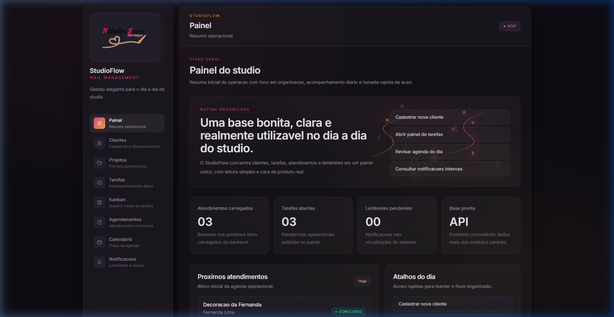
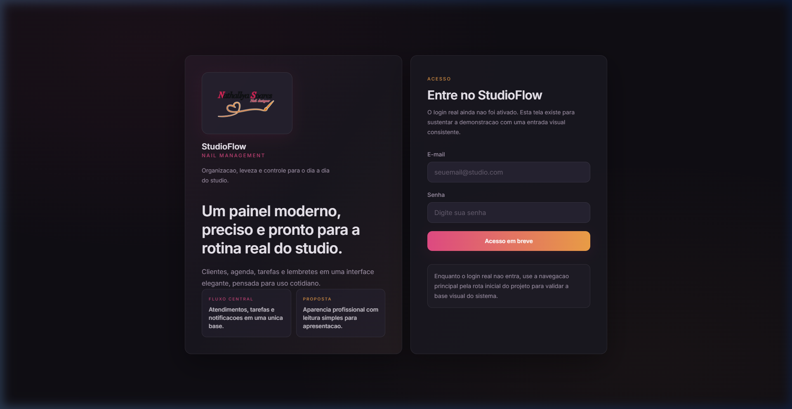
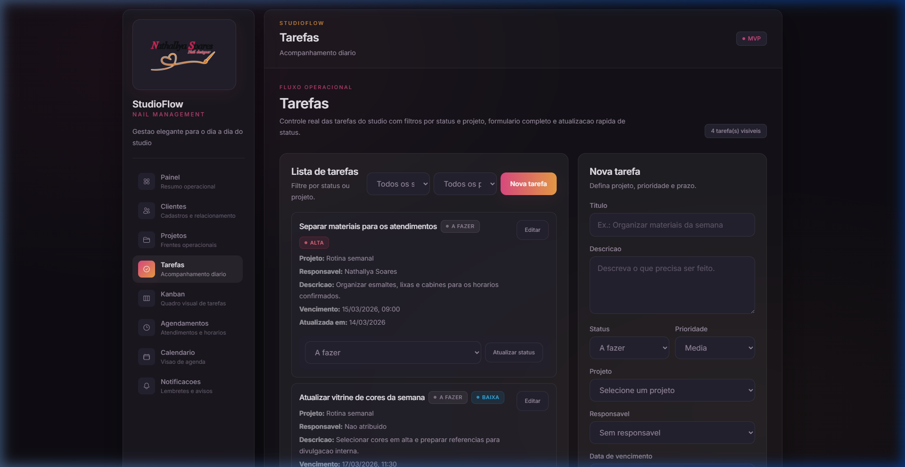
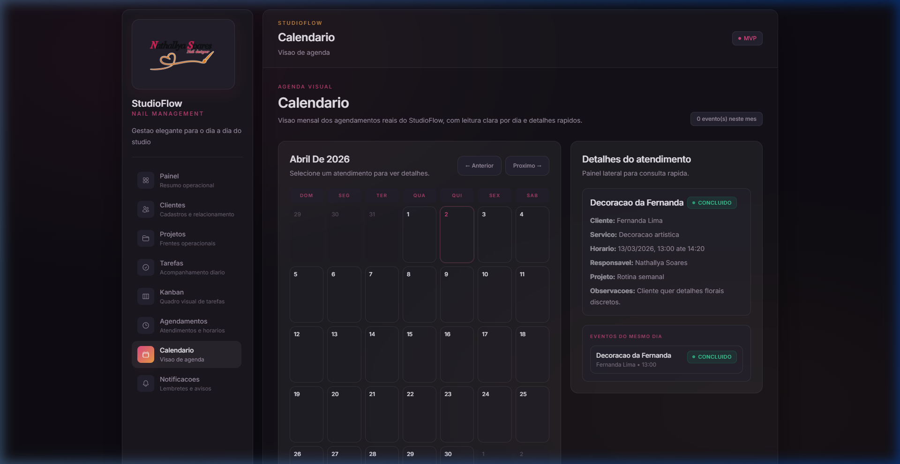
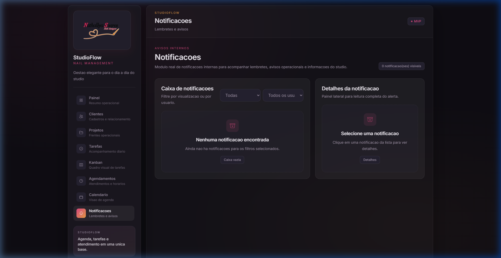

# StudioFlow

Sistema web para gestão operacional de um studio de unhas, desenvolvido como projeto de extensão universitária com foco em organização da rotina, acompanhamento de atendimentos, tarefas internas e lembretes.

<p align="center">
  
</p>

## Visão geral

O StudioFlow nasceu a partir de uma necessidade real observada em um studio de unhas que utilizava agenda física e anotações manuais para apoiar o controle do dia a dia. O objetivo do sistema é centralizar informações operacionais em uma aplicação web simples, profissional e defensável academicamente.

O projeto foi construído em monorepo, com backend em Spring Boot e frontend em React, permitindo evolução incremental dos módulos sem inflar o escopo.

## Problema resolvido

Antes do sistema, a operação do studio dependia fortemente de registros manuais. Isso dificultava:

- visualizar a rotina em um único lugar
- acompanhar clientes e atendimentos
- controlar tarefas operacionais
- lembrar compromissos importantes
- ter uma visão mais clara da agenda e das pendências

O StudioFlow foi projetado para resolver esse cenário com uma base funcional enxuta, mas real.

## Objetivo do projeto

Desenvolver uma plataforma web para apoiar a gestão de um studio de unhas por meio de:

- cadastro de usuários
- cadastro e manutenção de clientes
- controle de projetos operacionais
- gestão de tarefas
- gestão de agendamentos
- visualização em calendário
- notificações internas
- dashboard com visão resumida da operação

## Estado atual

O projeto já possui backend funcional, frontend integrado e dados sintéticos para demonstração local.

### Módulos disponíveis

- Dashboard
- Usuários
- Clientes
- Projetos
- Tarefas
- Agendamentos
- Calendário
- Notificações

### Observação sobre Kanban

O Kanban foi removido da interface do sistema e o fluxo visual de tarefas pode ser conduzido externamente em ferramentas como Trello, conforme a decisão atual do projeto.

## Stack utilizada

### Backend

- Java 21
- Spring Boot 3
- Maven
- Spring Web
- Spring Data JPA
- Spring Security
- Bean Validation
- Flyway
- Lombok
- PostgreSQL
- H2 para modo demo e testes

### Frontend

- React
- Vite
- TypeScript
- Tailwind CSS
- React Router

### Testes

- JUnit 5
- Spring Boot Test
- MockMvc
- Mockito
- H2 para integração local de testes

## Estrutura do repositório

```text
Studio_extensao/
├── backend/
│   ├── src/main/java/com/studioflow/backend
│   │   ├── config
│   │   ├── controller
│   │   ├── dto
│   │   ├── entity
│   │   ├── exception
│   │   ├── repository
│   │   ├── security
│   │   └── service
│   └── src/main/resources
│       ├── db/migration
│       ├── application.yml
│       ├── application-dev.yml
│       └── application-demo.yml
├── frontend/
│   ├── public
│   └── src
│       ├── components
│       ├── hooks
│       ├── layouts
│       ├── pages
│       ├── router
│       ├── services
│       ├── types
│       └── utils
└── docs/
```

## Arquitetura

O projeto segue o modelo cliente-servidor:

- o backend expõe a API REST, aplica regras de negócio, validações e persistência
- o frontend consome a API, organiza a navegação e entrega a interface de uso
- o banco relacional guarda os dados operacionais do studio

### Responsabilidades do backend

- CRUD dos módulos principais
- validação de entrada
- tratamento padronizado de erros
- versionamento do banco com Flyway
- seed de desenvolvimento e demonstração

### Responsabilidades do frontend

- interface visual do sistema
- navegação por rotas
- consumo centralizado da API
- formulários e feedbacks visuais
- dashboard e visualizações operacionais

## Modelagem principal

As entidades centrais do sistema são:

- `Usuario`
- `Cliente`
- `Projeto`
- `Tarefa`
- `Agendamento`
- `Notificacao`

### Relações principais

- um `Projeto` possui várias `Tarefas`
- um `Projeto` pode agrupar vários `Agendamentos`
- um `Cliente` pode possuir vários `Agendamentos`
- um `Usuario` pode ser responsável por `Tarefas` e `Agendamentos`
- um `Usuario` recebe `Notificacoes`
- uma `Notificacao` pode estar vinculada a um `Agendamento`

Para mais detalhes, consulte:

- [docs/modelagem-dominio.md](docs/modelagem-dominio.md)
- [docs/backend-api.md](docs/backend-api.md)

## Funcionalidades implementadas

### Dashboard

- indicadores resumidos
- próximos atendimentos
- tarefas pendentes
- notificações não visualizadas

### Usuários

- criação
- listagem
- edição
- inativação lógica

### Clientes

- listagem
- filtro por ativos e inativos
- criação
- edição
- inativação lógica

### Projetos

- listagem
- filtro por status
- criação
- edição
- atualização de status

### Tarefas

- listagem
- filtros por status e projeto
- criação
- edição
- atualização rápida de status

### Agendamentos

- listagem
- filtros por status, cliente e intervalo
- criação
- edição
- atualização de status

### Calendário

- visão mensal
- leitura dos agendamentos reais
- painel lateral com detalhes do evento

### Notificações

- listagem
- filtros por usuário e visualização
- marcação como visualizada

## Capturas de tela

<table>
  <tr>
    <td align="center"><strong>Login</strong></td>
    <td align="center"><strong>Dashboard</strong></td>
  </tr>
  <tr>
    <td></td>
    <td></td>
  </tr>
  <tr>
    <td align="center"><strong>Tarefas</strong></td>
    <td align="center"><strong>Calendário</strong></td>
  </tr>
  <tr>
    <td></td>
    <td></td>
  </tr>
  <tr>
    <td align="center"><strong>Notificações</strong></td>
    <td align="center"><strong>Dados de demonstração</strong></td>
  </tr>
  <tr>
    <td></td>
    <td align="center">O backend possui seed local para facilitar a demonstração do sistema.</td>
  </tr>
</table>

## Como executar

### Pré-requisitos

- Java 21 instalado
- Maven instalado
- Node.js instalado
- npm instalado
- PostgreSQL instalado, se desejar usar o perfil real de desenvolvimento

## Execução rápida em modo demo

O modo demo é o mais indicado para demonstração local, porque utiliza H2 persistente com seed automático.

### 1. Subir o backend

```bash
cd backend
mvn spring-boot:run
```

Por padrão, o projeto sobe com o profile `demo`.

Backend disponível em:

- `http://localhost:8080`
- healthcheck: `http://localhost:8080/api/health`

### 2. Subir o frontend

```bash
cd frontend
npm install
npm run dev
```

Abra no navegador a URL informada pelo Vite. Normalmente:

- `http://localhost:5173`

Se a porta estiver ocupada, o Vite sobe em outra, como `5174` ou `5175`.

## Execução com PostgreSQL

Se quiser rodar com banco PostgreSQL real:

### 1. Criar o banco

```sql
CREATE DATABASE studioflow;
```

### 2. Definir credenciais

Variáveis aceitas:

- `DB_HOST`
- `DB_PORT`
- `DB_NAME`
- `DB_USERNAME`
- `DB_PASSWORD`

Exemplo no PowerShell:

```powershell
$env:DB_HOST="localhost"
$env:DB_PORT="5432"
$env:DB_NAME="studioflow"
$env:DB_USERNAME="postgres"
$env:DB_PASSWORD="sua_senha"
```

### 3. Iniciar o backend com profile dev

```bash
cd backend
mvn spring-boot:run -Dspring-boot.run.profiles=dev
```

## Dados sintéticos

O projeto inclui dados sintéticos para facilitar demonstração e validação local.

### Seed em demo/dev

Ao subir o backend em `demo` ou `dev`, o sistema pode popular automaticamente:

- usuário base
- projeto base
- clientes sintéticos
- tarefas sintéticas
- agendamentos sintéticos

### Migrations de seed

Além do seed em runtime, existem migrations SQL com dados de clientes:

- `V2__seed_sample_clientes.sql`
- `V3__seed_more_sample_clientes.sql`

## Endpoints principais da API

### Saúde da aplicação

- `GET /api/health`

### Usuários

- `POST /api/usuarios`
- `GET /api/usuarios`
- `GET /api/usuarios/{id}`
- `PUT /api/usuarios/{id}`
- `PATCH /api/usuarios/{id}/inativar`

### Clientes

- `POST /api/clientes`
- `GET /api/clientes`
- `GET /api/clientes/{id}`
- `PUT /api/clientes/{id}`
- `PATCH /api/clientes/{id}/inativar`

### Projetos

- `POST /api/projetos`
- `GET /api/projetos`
- `GET /api/projetos/{id}`
- `PUT /api/projetos/{id}`
- `PATCH /api/projetos/{id}/status`

### Tarefas

- `POST /api/tarefas`
- `GET /api/tarefas`
- `GET /api/tarefas/{id}`
- `PUT /api/tarefas/{id}`
- `PATCH /api/tarefas/{id}/status`

Filtros:

- `status`
- `projetoId`

### Agendamentos

- `POST /api/agendamentos`
- `GET /api/agendamentos`
- `GET /api/agendamentos/{id}`
- `PUT /api/agendamentos/{id}`
- `PATCH /api/agendamentos/{id}/status`

Filtros:

- `status`
- `clienteId`
- `dataInicio`
- `dataFim`

### Notificações

- `POST /api/notificacoes`
- `GET /api/notificacoes`
- `GET /api/notificacoes/{id}`
- `PATCH /api/notificacoes/{id}/visualizar`

Filtros:

- `usuarioId`
- `visualizada`

Documentação resumida da API:

- [docs/backend-api.md](docs/backend-api.md)

## Testes

### Backend

Rodar testes automatizados:

```bash
cd backend
mvn test
```

Gerar pacote sem testes:

```bash
cd backend
mvn -DskipTests package
```

### Frontend

Build de produção:

```bash
cd frontend
npm run build
```

Lint:

```bash
cd frontend
npm run lint
```

## Padrões adotados

### Branches

- `main`
- `develop`
- `feature/<nome>`
- `fix/<nome>`
- `docs/<nome>`

### Commits

- `feat:`
- `fix:`
- `docs:`
- `refactor:`
- `test:`
- `chore:`

## Documentação complementar

- [docs/visao-produto.md](docs/visao-produto.md)
- [docs/arquitetura-inicial.md](docs/arquitetura-inicial.md)
- [docs/modelagem-dominio.md](docs/modelagem-dominio.md)
- [docs/backend-api.md](docs/backend-api.md)
- [docs/padroes-de-desenvolvimento.md](docs/padroes-de-desenvolvimento.md)

## Limitações atuais

Itens ainda não implementados:

- autenticação real com JWT
- login funcional completo
- criptografia de senha
- notificações automáticas no navegador
- integrações externas
- app mobile nativo

## Melhorias futuras

- autenticação e autorização reais
- refinamento de dashboard
- relatórios operacionais simples
- filtros mais avançados
- melhorias extras de UX
- deploy em nuvem

## Autor

**Matheus Neves**  
Projeto de extensão universitária  
Curso de Análise e Desenvolvimento de Sistemas

