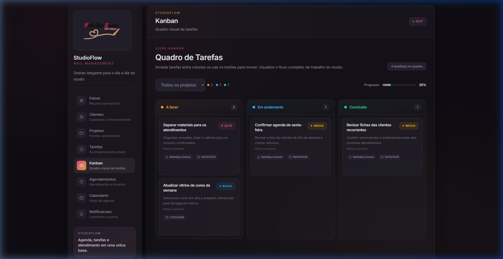
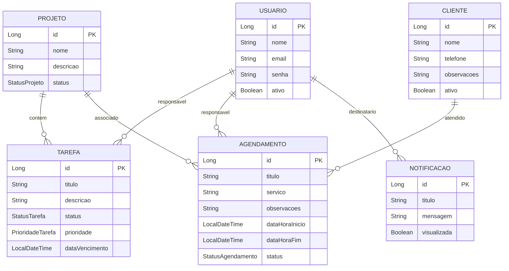

<p align="center">
  
</p>

<h1 align="center">💅 StudioFlow</h1>

<p align="center">
  <strong>Sistema web para gestão de atendimentos, tarefas e organização operacional de um studio de unhas</strong>
</p>

<p align="center">
  
  
  
  
  
  
</p>

---

## 📋 Sobre o Projeto

O **StudioFlow** é um sistema web desenvolvido como parte de um **projeto de extensão universitária** (Projeto Integrador III-B — PUC Goiás), em parceria com o **Studio Nathalya Soares**, um empreendimento real do segmento de beleza localizado em Goiânia–GO.

O studio utilizava agenda física e anotações manuais para controlar atendimentos, tarefas e lembretes. O StudioFlow surgiu para **centralizar essas informações** em uma aplicação moderna, organizada e acessível via navegador.

### 🎯 Objetivos

- Permitir o cadastro e gerenciamento de clientes
- Organizar atendimentos por data, horário, serviço e status
- Cadastrar e acompanhar tarefas operacionais
- Visualizar a agenda em formato de calendário mensal
- Oferecer um quadro Kanban para gestão visual de tarefas
- Disponibilizar notificações internas para lembretes e avisos

---

## 🖥️ Capturas de Tela

<table>
  <tr>
    <td align="center"><strong>Login</strong></td>
    <td align="center"><strong>Dashboard</strong></td>
  </tr>
  <tr>
    <td></td>
    <td></td>
  </tr>
  <tr>
    <td align="center"><strong>Tarefas</strong></td>
    <td align="center"><strong>Quadro Kanban</strong></td>
  </tr>
  <tr>
    <td></td>
    <td></td>
  </tr>
  <tr>
    <td align="center"><strong>Calendário</strong></td>
    <td align="center"><strong>Notificações</strong></td>
  </tr>
  <tr>
    <td></td>
    <td></td>
  </tr>
</table>

---

## 🏗️ Arquitetura

O projeto segue uma arquitetura **cliente-servidor** organizada em **monorepo**:

```
StudioFlow/
├── backend/          # API REST — Java 21 + Spring Boot 3
├── frontend/         # SPA — React + TypeScript + Tailwind CSS
└── docs/             # Documentação do projeto
    ├── visao-produto.md
    ├── arquitetura-inicial.md
    ├── modelagem-dominio.md
    ├── backend-api.md
    ├── padroes-de-desenvolvimento.md
    └── screenshots/
```

### Backend

| Camada | Responsabilidade |
|---|---|
| `controller/` | Endpoints REST, recebe e valida requisições |
| `service/` | Regras de negócio e orquestração |
| `repository/` | Acesso a dados via Spring Data JPA |
| `entity/` | Entidades JPA mapeadas ao banco |
| `dto/` | Objetos de transferência (entrada e saída) |
| `config/` | CORS, segurança, seed de dados |
| `exception/` | Tratamento global de erros |

### Frontend

| Diretório | Responsabilidade |
|---|---|
| `pages/` | Telas completas (Dashboard, Clientes, Kanban, etc.) |
| `components/` | Componentes reutilizáveis (AppCard, StatusBadge, etc.) |
| `services/` | Comunicação com a API REST |
| `layouts/` | Layout principal com sidebar e header |
| `types/` | Tipos TypeScript do domínio |
| `hooks/` | Hooks personalizados |
| `utils/` | Funções utilitárias (formatadores, tratamento de erros) |

---

## 🗃️ Modelagem de Domínio

O sistema é composto por **6 entidades principais**:



---

## 🛠️ Tecnologias

### Backend
- **Java 21** — Linguagem principal
- **Spring Boot 3.5** — Framework web e DI
- **Spring Data JPA** — Persistência e ORM
- **Spring Security** — Configuração de segurança
- **Bean Validation** — Validação de entrada
- **Flyway** — Migrações de banco de dados
- **Lombok** — Redução de boilerplate
- **PostgreSQL** — Banco de dados relacional (produção)
- **H2** — Banco embarcado (modo demo e testes)

### Frontend
- **React 19** — Biblioteca de UI
- **Vite** — Build tool e dev server
- **TypeScript 5** — Tipagem estática
- **Tailwind CSS** — Estilização utilitária
- **React Router** — Navegação SPA

### Testes
- **JUnit 5** — Framework de testes
- **MockMvc** — Testes de controllers
- **Mockito** — Mocks para testes de services
- **H2** — Banco in-memory para testes de integração

---

## 🚀 Como Executar

### Pré-requisitos

- Java 21+
- Node.js 18+
- Maven 3.9+ (ou usar o wrapper `mvnw` incluído)
- PostgreSQL 15+ *(opcional — o modo demo usa H2)*

### Modo Demo (sem PostgreSQL)

O modo padrão do projeto usa o **perfil `demo`** com banco H2 embarcado e **dados de exemplo pré-carregados**.

**1. Backend**

```bash
cd backend
./mvnw spring-boot:run
```

O servidor inicia em `http://localhost:8080` com dados de demonstração já populados.

**2. Frontend**

```bash
cd frontend
npm install
npm run dev
```

Acesse `http://localhost:5173` no navegador.

### Modo Desenvolvimento (com PostgreSQL)

**1. Crie o banco de dados**

```sql
CREATE DATABASE studioflow;
```

**2. Inicie o backend com perfil `dev`**

```bash
cd backend
./mvnw spring-boot:run -Dspring-boot.run.profiles=dev
```

Variáveis de ambiente aceitas:

| Variável | Padrão |
|---|---|
| `DB_HOST` | `localhost` |
| `DB_PORT` | `5432` |
| `DB_NAME` | `studioflow` |
| `DB_USERNAME` | `postgres` |
| `DB_PASSWORD` | `postgres` |

**3. Inicie o frontend**

```bash
cd frontend
npm install
npm run dev
```

### Executar Testes

```bash
cd backend
./mvnw test
```

---

## 📂 Funcionalidades

| Módulo | Descrição |
|---|---|
| **Dashboard** | Painel com visão geral: atendimentos próximos, tarefas abertas, indicadores e atalhos |
| **Clientes** | CRUD completo com inativação (soft delete) e campo de observações |
| **Projetos** | Gestão de frentes operacionais com status (Planejado, Em andamento, Concluído) |
| **Tarefas** | CRUD com filtros por status/projeto, prioridade, responsável e atualização rápida de status |
| **Kanban** | Quadro visual com 3 colunas (A fazer, Em andamento, Concluído), drag-and-drop e barra de progresso |
| **Agendamentos** | Controle de atendimentos com data, horário, serviço, cliente, status e observações |
| **Calendário** | Visualização mensal da agenda com painel lateral de detalhes do atendimento |
| **Notificações** | Lembretes internos com filtros e marcação como lida |

---

## 📚 Documentação

| Documento | Descrição |
|---|---|
| [`visao-produto.md`](docs/visao-produto.md) | Escopo do produto, problema e objetivos |
| [`arquitetura-inicial.md`](docs/arquitetura-inicial.md) | Decisões arquiteturais e divisão de responsabilidades |
| [`modelagem-dominio.md`](docs/modelagem-dominio.md) | Entidades, atributos, enums e relacionamentos |
| [`backend-api.md`](docs/backend-api.md) | Endpoints da API REST |
| [`padroes-de-desenvolvimento.md`](docs/padroes-de-desenvolvimento.md) | Convenções do projeto |

---

## 🔮 Melhorias Futuras

- [ ] Autenticação real com JWT
- [ ] Criptografia de senhas (BCrypt)
- [ ] Notificações automáticas no navegador (push)
- [ ] Relatórios operacionais
- [ ] Filtros avançados e busca textual
- [ ] Deploy em nuvem (Railway / Render)
- [ ] Integração com WhatsApp para lembretes

---

## 👤 Autor

**Matheus Neves**
Análise e Desenvolvimento de Sistemas — PUC Goiás

Projeto Integrador III-B — Extensão Universitária (2026)

---

<p align="center">
  <sub>Feito com ☕ e 💅 para o Studio Nathalya Soares</sub>
</p>
